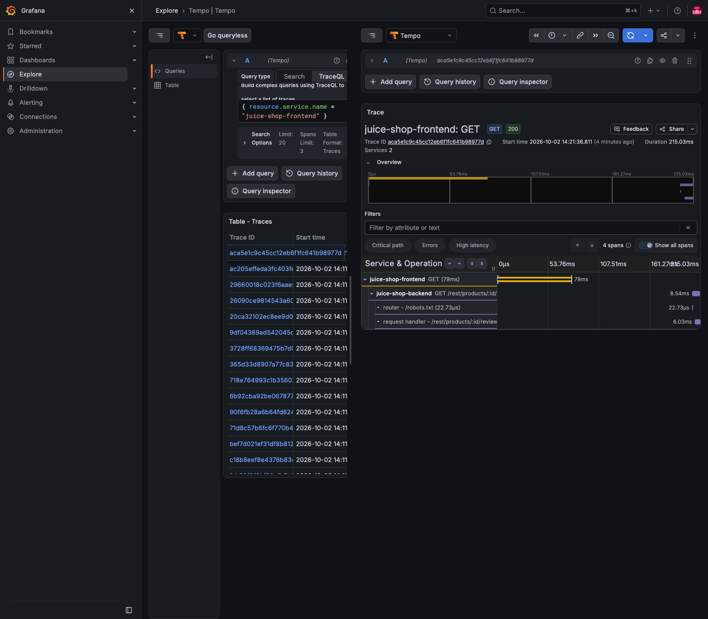
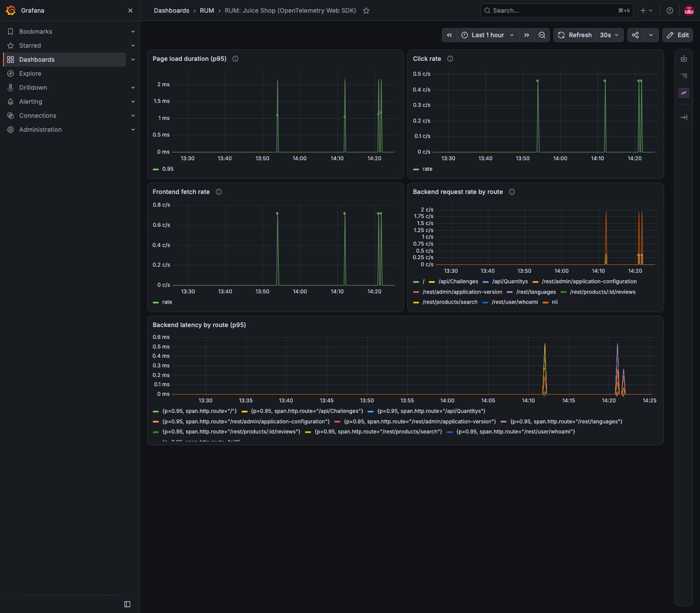

# observability-opentelemetry-rum-demo

Real User Monitoring (RUM) with the OpenTelemetry Web SDK — page-load, click and fetch spans
captured straight from the browser — joined into full distributed traces by auto-instrumenting
the backend too: the same-origin fetch calls already carry `traceparent`, so the backend just
needs to read it.

[OWASP Juice Shop](https://github.com/juice-shop/juice-shop) is the target app — a real,
actively-maintained Angular + Express SPA with zero existing OpenTelemetry code. It is not
vendored in this repo: `setup.sh` clones it fresh (pinned to `v20.2.0`) and applies a small
instrumentation overlay on top, so a `git diff` inside the clone shows exactly what was added.

```text
[ Your browser ]                                                    [ EC2: grafana (:3001) ]
       │  page (:3000)                                                        │
       ▼                                                                      ▼
[ EC2: juice-shop container ] --(same-origin fetch, traceparent)--> [ backend: auto-instrumented ]
       │                                                                      │
       └----------------------------OTLP/HTTP (:4318, CORS)-------------------┘
                                            │
                                            ▼
                                  [ EC2: otel-collector ] --> [ EC2: tempo ]
```

The browser making the page request is your own laptop, not the EC2 — so the exporter in
`overlay/frontend/src/tracer.ts` points at `window.location.hostname:4318`, never `localhost`.
The backend's exporter in `overlay/tracing.ts` points at `otel-collector:4318` instead — a
container-to-container address on the compose network, not the public one.

## Repository layout

| Path | What it is |
| --- | --- |
| `infra/` | Terraform: one EC2 (Amazon Linux 2023, Docker pre-installed via `user_data`) + one security group |
| `overlay/` | The only code this repo owns: `tracer.ts` + patched `main.ts`/`frontend/package.json` (frontend), `tracing.ts` + patched `app.ts`/`package.json` (backend) |
| `setup.sh` | Clones Juice Shop, applies the overlay, runs `docker compose up --build` |
| `docker-compose.yml`, `otel-collector-config.yaml`, `tempo.yaml`, `grafana/` | The observability stack, including a provisioned RUM dashboard (`grafana/dashboards/rum.json`) |

## Prerequisites

- AWS credentials in your shell, and your public IP (`curl -s https://checkip.amazonaws.com`).
- Terraform 1.9+.

## 1. Create the EC2 host

```bash
cp infra/terraform.tfvars.example infra/terraform.tfvars
# edit ssh_cidr to your IP with /32

terraform -chdir=infra init
terraform -chdir=infra apply
```

Outputs include `public_ip`, `ssh_command`, `juice_shop_url`, `grafana_url`. An SSH key pair
is generated for you (`infra/rum-demo-key.pem`, gitignored).

## 2. Deploy the stack

This repo is private, so copy it to the instance directly rather than `git clone`-ing on
the EC2:

```bash
IP=$(terraform -chdir=infra output -raw public_ip)
rsync -avz -e "ssh -i infra/rum-demo-key.pem" \
  --exclude='.git' --exclude='juice-shop' --exclude='infra' \
  ./ "ec2-user@$IP:/home/ec2-user/observability-opentelemetry-rum-demo/"

ssh -i infra/rum-demo-key.pem "ec2-user@$IP"
# on the EC2:
cd observability-opentelemetry-rum-demo
./setup.sh
```

The first build takes 5-10 minutes — the Dockerfile does a full `npm install` plus an
Angular production build; a rebuild with Docker's layer cache warm took 4m27s in practice.
Expect `docker compose ps` to show four containers, all `Up`:

```text
NAME                 IMAGE                                     STATUS
grafana              grafana/grafana:13.2.3                    Up
juice-shop           observability-opentelemetry-rum-demo-...  Up
otel-collector       otel/opentelemetry-collector-contrib:...  Up
tempo                grafana/tempo:3.1.0                        Up
```

## 3. See it

Open `juice_shop_url` in a **real browser** (the OTLP export happens client-side) and click
around — view a product, add it to the cart. One fixed, narrow journey like this keeps the
captured trace legible; free-roaming the app pulls in its own background chatter (i18n
loads, challenge tracking) that `tracer.ts` already filters out of the fetch spans but not
out of clicks.

Open `grafana_url`, log in as `admin` with the password `setup.sh` printed at the end of its
run (it generates one and passes it to Compose — Grafana's port is public, so it is never
left at a weak default), and go to **Explore → Tempo**. Search by service name
`juice-shop-frontend`. A trace should show:

- a document-load span (`documentFetch`, `resourceFetch`, `domContentLoadedEvent`),
- a user-interaction span for the click,
- fetch spans for the API calls that click triggered.

A fourth: expand the backend's own span under the same trace. The fetch call was same-origin,
so the browser already sent `traceparent` with it — `overlay/tracing.ts` auto-instruments the
backend (`getNodeAutoInstrumentations`) so it reads that header and creates a matching server
span, closing the loop into a real distributed trace with no extra frontend code.

Verified for real against a live instance, queried through Grafana's own datasource proxy
(`/api/datasources/proxy/uid/tempo/api/search` and `/api/traces/<id>`):

- a `documentLoad` trace (1133ms), several `click` traces, and `GET` (fetch) traces all
  landed in Tempo under `service.name = "juice-shop-frontend"` — the three signals the
  gemini notes asked for.
- a single trace ID containing both `['juice-shop-frontend'] GET (CLIENT)` and
  `['juice-shop-backend'] GET /rest/products/:id/reviews (SERVER)` — real, verified
  frontend-to-backend correlation, not assumed from the instrumentation's documentation.



## Dashboard

A provisioned Grafana dashboard (`grafana/dashboards/rum.json`, folder **RUM**) — five
panels, all **TraceQL metrics** queries straight against Tempo, no Prometheus or
metrics-generator involved:

| Panel | Query |
| --- | --- |
| Page load duration (p95) | `{ resource.service.name = "juice-shop-frontend" && name = "documentLoad" } \| quantile_over_time(duration, .95)` |
| Click rate | `{ resource.service.name = "juice-shop-frontend" && name = "click" } \| rate()` |
| Frontend fetch rate | `{ resource.service.name = "juice-shop-frontend" && name = "GET" } \| rate()` |
| Backend request rate by route | `{ resource.service.name = "juice-shop-backend" && kind = server } \| rate() by (span.http.route)` |
| Backend latency by route (p95) | `{ resource.service.name = "juice-shop-backend" && kind = server } \| quantile_over_time(duration, .95) by (span.http.route)` |



## Iterating

Edit anything under `overlay/frontend/src/` locally, `rsync` the changed file(s) up, then on
the EC2 (inside `observability-opentelemetry-rum-demo/`):

```bash
cp -r overlay/* juice-shop/
docker compose build juice-shop && docker compose up -d juice-shop
```

## Known gotchas

- **OTLP endpoint must be host-relative, not `localhost`.** The page is loaded from the
  EC2's IP by a remote browser; a hardcoded `localhost:4318` in `tracer.ts` would point at
  the visitor's own machine, not the collector.
- **Collector CORS is mandatory.** `otel-collector-config.yaml`'s `receivers.otlp.protocols.http.cors`
  block is what lets the browser's preflight `OPTIONS` through; without it nothing reaches Tempo.
- **Tempo storage is ephemeral.** `docker compose down -v` or an instance stop loses all
  traces — expected for a demo, not a bug.
- **AL2023's packaged `docker` ships buildx 0.12, too old for `docker compose build`** (needs
  0.17+); fails with `compose build requires buildx 0.17.0 or later`. `infra/user_data.sh`
  replaces the plugin with a current release — not something we expected to need going in.
- **Juice Shop's own `frontend` build script is broken on this exact version, unrelated to
  our changes.** `npm run build` chains `ng build --configuration production && npm run
  sbom`, and the `sbom` step looks for `dist/frontend/stats.json`. That file is never
  produced: `statsJson: true` in `angular.json` is a leftover option from the old
  webpack-based builder, and the project has since moved to `@angular/build:application`,
  whose schema has no such key — grep confirms it isn't there. `overlay/frontend/package.json`
  drops `&& npm run sbom` from the `build` script. We don't need an SBOM for this demo; a
  real contribution upstream would fix the builder config instead.
- **The dashboard needs no Prometheus.** Tempo 3.x computes TraceQL metrics
  (`rate()`, `quantile_over_time()`, …) on the fly from stored blocks — a feature ("local
  blocks") enabled by default since the old `no-local-blocks` flag was deprecated. Verified
  directly against `/api/metrics/query_range`: real series came back with no
  `metrics_generator`/`remote_write` config anywhere in `tempo.yaml`.
- **Node's auto-instrumentation is noisy by default, in two different ways.** Juice Shop's
  own startup reachability checks (alchemy.com, a local LLM) show up as rootless
  `tcp.connect`/`tls.connect` traces from `@opentelemetry/instrumentation-net`; Express
  wraps every middleware (cors, compression, i18n, …) in its own span, about 20 per request,
  from `@opentelemetry/instrumentation-express`'s default `ignoreLayersType`. `tracing.ts`
  disables `instrumentation-net`/`instrumentation-dns` outright and sets
  `ignoreLayersType: [ExpressLayerType.MIDDLEWARE]` so only the router and the actual
  request handler get a span. Verified before/after: a real request trace went from ~24
  spans to 4.

## Cleanup

```bash
# on the EC2
docker compose down -v

# locally
terraform -chdir=infra destroy
```

## References

- [OpenTelemetry Web SDK](https://opentelemetry.io/docs/languages/js/getting-started/browser/)
- [OWASP Juice Shop](https://github.com/juice-shop/juice-shop)
- [Grafana Tempo](https://grafana.com/docs/tempo/latest/)

## License

MIT
