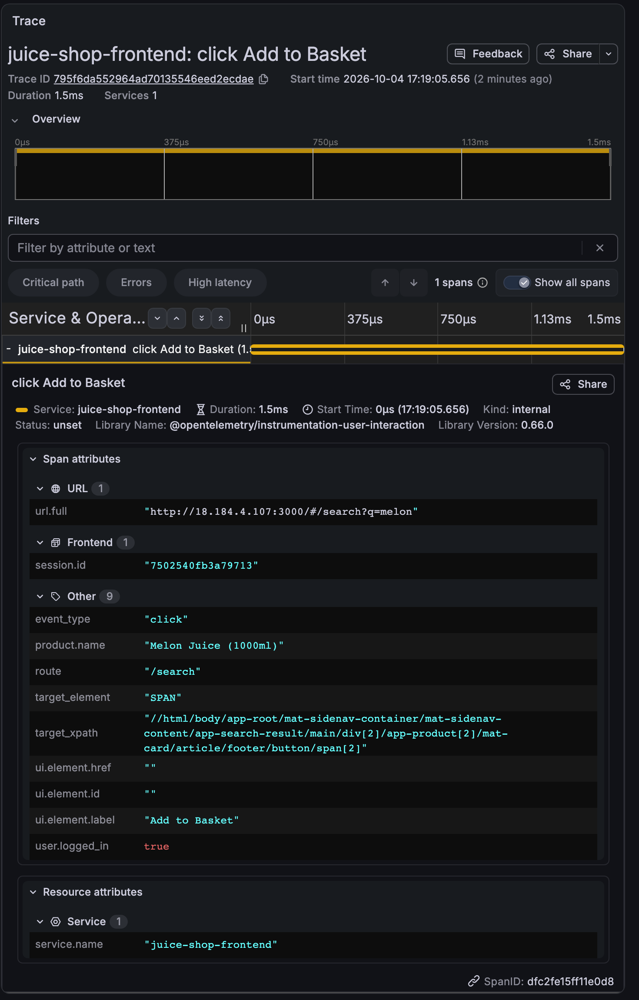

# 1. Frontend tracer (`overlay/frontend/src/tracer.ts`)

**Before:** the file does not exist. Juice Shop has no OpenTelemetry code.
**After:** [115 lines](../../overlay/frontend/src/tracer.ts). The first 35 or so give you
page-load, click and fetch spans. Everything after that makes the data answer business
questions. Each layer below stands alone, so you can stop at any of them.

## Layer 1: the basics (what you get with no thought)

```ts
const provider = new WebTracerProvider({
  resource: resourceFromAttributes({ [ATTR_SERVICE_NAME]: 'juice-shop-frontend' }),
  spanProcessors: [new BatchSpanProcessor(new OTLPTraceExporter({ url: collectorUrl }))]
})
provider.register({ contextManager: new ZoneContextManager() })

registerInstrumentations({
  tracerProvider: provider,
  instrumentations: [
    new DocumentLoadInstrumentation(),
    new UserInteractionInstrumentation(),
    new FetchInstrumentation({ ignoreUrls: [/\/assets\/i18n\//] })
  ]
})
```

Result in Tempo: a span called `click` with `target_element=SPAN` and a long xpath. No
label, no id. A dashboard built on this says "clicks: 0.4/s" and nothing else.

## Layer 2: name the clicks

**Before:** `new UserInteractionInstrumentation()`

**After:**

```ts
new UserInteractionInstrumentation({
  eventNames: ['click', 'submit'],          // login runs on form submit, not click
  shouldPreventSpanCreation: (event, element, span) => {
    const d = describe(element)             // closest button/link: id, aria-label, text, routerLink
    span.setAttribute('ui.element.id', d.id)
    span.setAttribute('ui.element.label', d.label)
    span.setAttribute('ui.element.href', d.href)
    span.updateName(`${event} ${d.id || d.label || element.tagName.toLowerCase()}`)
    return false                            // false = keep the span
  }
})
```

Result: `click` becomes `click loginButton`, `click Add to Basket`, `submit login-form`.
Side effect: anything that filtered on `name = "click"` stops matching. The technical
dashboard now filters on `span.event_type = "click"` ([change 6](06-technical-dashboard.md)).

`describe()` never reads input values, and names inputs and forms by id only.

## Layer 3: page views

**Before:** `documentLoad` fires once per tab. In a hash-routed single-page app nothing
says where the user went next.

**After:**

```ts
window.addEventListener('hashchange', () => {
  tracer.startSpan('navigation', { attributes: { route: currentRoute() } }).end()
})
```

`currentRoute()` collapses ids (`/order-completion/5267-...` becomes `/order-completion/:id`)
so routes stay countable.

## Layer 4: session and signed-in flag

**Before:** spans are anonymous and unrelated to each other.

**After:** a span processor stamps every span:

```ts
onStart (span) {
  span.setAttribute('session.id', sessionId)                          // random, per tab
  span.setAttribute('user.logged_in', !!localStorage.getItem('token')) // boolean only
}
```

No email and no user id leave the browser. This is also how you join a click to the API
call it caused: the two are not parent and child (see the main README), but they share
`session.id` and a timestamp.

## Layer 5: JavaScript errors

**Before:** none of the three instrumentations records a JS error.

**After:**

```ts
function reportError (type: string, message: unknown) {
  const span = tracer.startSpan('exception', { attributes: {
    'exception.type': type, 'exception.message': String(message).slice(0, 120), route: currentRoute() } })
  span.setStatus({ code: SpanStatusCode.ERROR })
  span.end()
}
window.addEventListener('error', e => reportError('error', e.message))
window.addEventListener('unhandledrejection', e => reportError('unhandledrejection', (e.reason as Error)?.message ?? e.reason))
```

Known limit: `unhandledrejection` never fires here, because Angular's zone.js handles rejected
promises before the browser event.

## Layer 6: product and search context (business metrics)

**Before:** an Add to Basket click is `click Add to Basket`, for every product. A page view
of a search is `navigation` with `route=/search`.

**After:**

```ts
// in the click hook
if (element.closest('button.btn-basket')) {
  const product = element.closest('mat-card')?.querySelector('.name')?.textContent?.trim()
  if (product) span.setAttribute('product.name', product.slice(0, 60))
}

// in the hashchange listener
const term = new URLSearchParams(window.location.hash.split('?')[1] ?? '').get('q')?.trim().toLowerCase().slice(0, 40)
tracer.startSpan('navigation', { attributes: { route: currentRoute(), ...(term ? { 'search.term': term } : {}) } }).end()
```

Two things to know before copying this. The `.name` selector is Juice Shop's own DOM, so
it needs rewriting for your app. And a search term is text a user typed: decide whether you
want it in your tracing backend before you ship it.

Result in Tempo:


