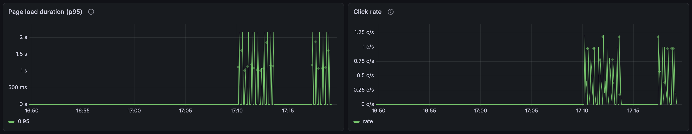
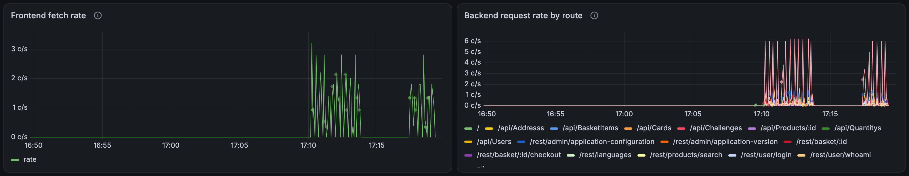

# 6. Technical dashboard (`grafana/dashboards/rum.json`)

**Before:** no dashboards. Grafana starts with the Tempo datasource only.
**After:** five panels in the **RUM** folder, all TraceQL metrics queries straight against
Tempo (no Prometheus, no metrics-generator).

| Panel | Query | Changed since first version |
| --- | --- | --- |
| Page load duration (p95) | `{ resource.service.name = "juice-shop-frontend" && name = "documentLoad" } \| quantile_over_time(duration, .95)` | unit `s` |
| Click rate | `{ resource.service.name = "juice-shop-frontend" && span.event_type = "click" } \| rate()` | was `name = "click"` |
| Frontend fetch rate | `{ resource.service.name = "juice-shop-frontend" && name = "GET" } \| rate()` | none |
| Backend request rate by route | `{ resource.service.name = "juice-shop-backend" && kind = server } \| rate() by (span.http.route)` | none |
| Backend latency by route (p95) | `{ ... kind = server } \| quantile_over_time(duration, .95) by (span.http.route)` | unit `s` |

**The click-rate change, in one line:** [change 1, layer 2](01-frontend-tracer.md) renames click
spans, so a filter on the name returned a flat zero. `span.event_type` is set by the
instrumentation and survives renaming.

Back to the [index](README.md).
