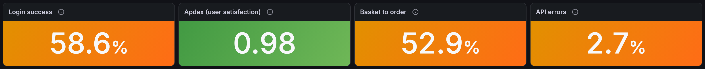
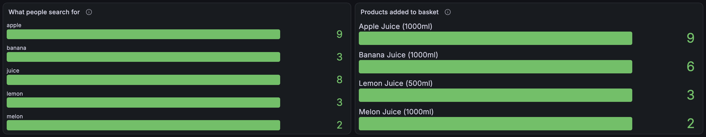

# 7. Business dashboard (`grafana/dashboards/rum-business.json`)

**Before:** the technical dashboard answers "what is happening". It cannot say whether
people can log in, whether the app felt fast, or what they were looking for.
**After:** a second dashboard in the same **RUM** folder, 13 panels, every query TraceQL
metrics against Tempo, every one run against live data before it was kept.

Shorthand below: `FE` = `resource.service.name = "juice-shop-frontend"`,
`BE` = `resource.service.name = "juice-shop-backend"`, `API` = `FE && kind = client`.

## The four numbers at the top

| Panel | Meaning | Query |
| --- | --- | --- |
| Login success | Share of login attempts the server accepted | `({ BE && kind = server && span.http.route = "/rest/user/login" && span.http.response.status_code = 200 } \| rate()) / ({ ...same without the status filter } \| rate())` |
| Apdex | See below | `(({ API && duration < 500ms } \| rate()) + ({ API && duration >= 500ms && duration < 2s } \| rate()) / 2) / ({ API } \| rate())` |
| Basket to order | Orders placed / items added | `({ BE && kind = server && span.http.route = "/rest/basket/:id/checkout" } \| rate()) / ({ BE && kind = server && span.http.request.method = "POST" && span.http.route = "/api/BasketItems" } \| rate())` |
| API errors | Share of the browser's API calls answered 4xx or 5xx | `({ API && span.http.response.status_code >= 400 } \| rate()) / ({ API } \| rate())` |

### Apdex, in full

Apdex turns "how long did people wait" into one number between 0 and 1. Pick a threshold
T (here 500 ms). A request faster than T is *satisfied* and counts 1. Slower than T but
faster than 4T (2 s) is *tolerating* and counts one half. Slower than that counts 0.

`Apdex = (satisfied + tolerating / 2) / total`

Read it as: 0.94 and up is excellent, 0.85 to 0.94 good, 0.7 to 0.85 fair, below 0.7 poor.
The thresholds on the panel use those bands. The duration is what the **browser** measured
on its fetch span, so slow networks and slow devices count against you, which is the point.

## The panels below them

| Panel | Query shape | Question |
| --- | --- | --- |
| Login attempts by outcome | `{ login route } \| rate() by (span.http.response.status_code)` | Is a 401 spike a wrong-password wave or an outage? |
| User-perceived latency | `{ API } \| quantile_over_time(duration, .5, .95, .99)` | How long do they wait? |
| Gap: browser vs server | `{ API or BE server } \| quantile_over_time(duration, .95) by (resource.service.name)` | How much of the wait is invisible to the backend? |
| Page views by route | `{ FE && name = "navigation" } \| rate() by (span.route)` | Where do they go? |
| What people search for | `{ FE && span.search.term != nil } \| count_over_time() by (span.search.term)` | What are they looking for? |
| Products added to basket | `{ FE && span.product.name != nil } \| count_over_time() by (span.product.name)` | What do they actually want? |
| Clicks by element | `{ FE && span.event_type = "click" } \| rate() by (name)` | What do they press? |
| Errors users hit | `{ (API && status >= 400) \|\| (FE && name = "exception") } \| rate() by (name)` | What breaks for them? |
| Checkout funnel | `{ BE server && (add \|\| view basket \|\| checkout route) } \| rate() by (span.http.route)` | How far do shoppers get? |

## Things that were wrong the first time

- **`legendFormat` is ignored** by the Tempo datasource. Split a series with `by (...)` in the query instead, or the legend shows a blank.
- **Durations come back in seconds**, so the panel unit is `s`, not `ms`.
- **The attribute is `http.request.method`**, not the older `http.method`, on the backend spans.
- **The funnel route is `/api/BasketItems`** with no trailing slash. A trailing slash matches nothing.
- **A stat showed `1.0` for 0.98.** Set `decimals` to 2 on the Apdex panel.
- **Basket to order is a ratio of two rates**, not a per-shopper conversion. Someone who adds three items and orders once counts as 1 order against 3 additions. For a real conversion rate, count distinct `session.id` values, which TraceQL metrics cannot do.
- **Quantiles are approximate.** Tempo estimates them from log-scale buckets.

## What it looked like

Back to the [index](README.md).
